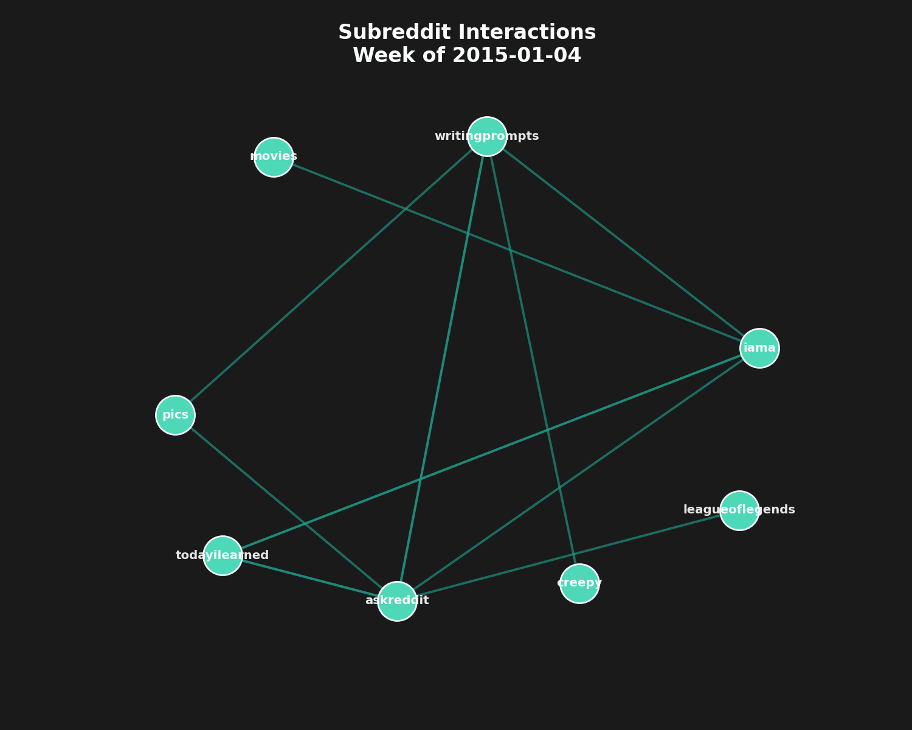

# Links for days : An insight into the structure of online dialogue

# Abstract
The aim of this analysis will be to visualize the dialogues that take place within a frequently communicating portion of subreddits, by unraveling causes, consequences, attacks and responses between these groups that often interact together. This is done by an analysis over non overlapping time windows of the changing weighted directed Reddit graph. What can we learn about conflicts and friendships from analyzing the dynamics that occur within a frequently interacting set of groups? Is it possible to detect the evolution of a conflict over time from the graph structure obtained?  Can different phases (initial interactions, phasing out, etc) or type of communication (mass attack, codependence, etc) be identified? What does this subset graph implies for the overall graph? 
Ultimately, this study seeks to provide a deeper understanding of how communities on Reddit organize, influence one another, and evolve through cycles of cooperation and conflict giving insight in the broader landscape of online discourse.

  
   
  <em>Weekly evolution of subreddit interactions during 2015.</em>

# Development of the project
This project started as a global time analysis of the dataset. The idea was that we might find some trend towards or against negativity. This analysis was not conclusive as we felt that a time period of only 3 years wasn’t long enough to see a trend. We decided to pivot to a project angled at the analysis of the dataset as a graph structure. It is complicated to get a concrete idea of what is at play in a graph of this size (50’000+ nodes, 800’000+ edges), our solution was to focus most of the project on a carefully chosen subset of subreddits. Finding the best subreddits subjects on which to perform the analysis is a key step of this project, for now we selected the subset that share the most interactions. This method presents an important flaw, some subreddits are specifically designed to have links to other subreddits and have consequently an inflated number of interactions with numerous subreddits that aren't representative of real friendships or conflicts. Finding the right subset of interacting communities is our priority.
The length of the time window considered is a crucial aspect, as it is responsible for the granularity of the analysis. A smaller window gives a more detailed visualization tool but might be overwhelming with irrelevant information, whereas a window that is too large won't allow us to see which event triggered a response.

# Specific questions and methods
Q° : What seems to bring these subreddits together ? Are they closely related or completely different ?  
-> Computation of cosine similarity between subreddits using the Word2Vecx embeddings given in the additional embeddings dataset.

Q° : Can we identify "troublemakers" within the population ?  
-> Time analysis of the initiators : find the first negative links sent that trigger a series of events  
    Do they have similarities (in size, graph-based structure, topic etc.)?

Q° : Are alliances made to coordinate/face attacks ? Are they temporary or long lasting friendships ?  
-> Long time graph visualization concerning subreddits with longterm dialogue.

Q° : How long does it take for an attack to be forgiven by the receiving end ? Meaning that they start interacting positively together again.  
-> Temporal analysis of the average link sentiment of individual subreddits to the attacker subreddits.

Q° : Can we find mechanisms that group conflicts follow that are similar to the ones in conflicts between individuals ? (peut etre too far haha)  
-> J'ai r compris mon frere

Q° : Can conflicts within the population spark seemingly unrelated conflicts between other subreddits ?
-> Graph analysis on the entire dataset in relation to part of the chosen subset. (Example : look at proprieties of a graph with only subreddit A as target/source before/after an identified attack)

# Proposed timeline
| **Week** |**Dates**| **Tasks** |
| :------: | :------: | ------ |
|**1** |6.11-12.11| <ul><li>Find target population for deeper analysis </li><li> Make more utils for time analysis, plotting and other general functionalities needed for the project</li></lu>|
|**2** |13.11-19.11| <ul><li>Start in-depth time analysis of our target population </li><li> Define attack/interaction window (to be able to relate interactions between two subreddits)</li></lu>|
|**3** |20.11-26.11|<ul><li>Start work on the datastory (probably with a github.io website) </li><li> Use a classifier to try to create groups for our target population (by topic, size, other metrics...) </li><li> Continue working on analyzing the target population with focus on "troublemakers" </li></lu> |
|**4** |27.11-03.12|<ul><li>Look for conflict sparking trends and possible alliances </li><li> Continue work on both data story and further analysis of the target population (bulk of our work should be this week)</li></lu>|
|**5** |4.12-10.12|<ul><li>Finalize the datastory, including text, interactive graphs and images </li><li> Wrap up analysis of our target population (time allocated for ideas not part of our initial planning) </li><li> Make sure all helpers and supporting code is mostly finalized</li></lu>|
|**6** |11.12-17.12|<ul><li>Fix bugs (if any) </li><li> Verify website layout and code clarity </li><li> Avoid adding new features/content, focus on correctness of the project</li></lu>|

# Internal milestones
- [ ] Found our target population
- [ ] Defined robust interaction window
- [ ] Found troublemakers (or proved that there are none ) 
- [ ] Datastory content complete
