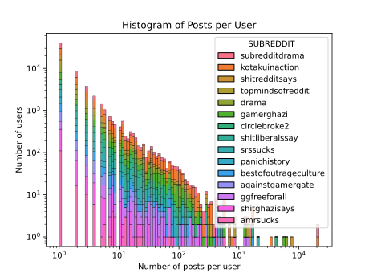
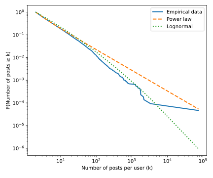

<!--- Script that closes the menu when clicking a nav link-->

# Introduction
## What are we talking about ?
Our datastory is about [Gamergate](https://en.wikipedia.org/wiki/Gamergate), an online harassement campaign against feminism, diversity, and progressivism in video game culture, that was present on multiple online platforms, including reddit. Two subreddits where created in response: r/KotakuInAction, r/GamerGhazi, which exclusively are about this topic. The trigger for this event was a blog post published in August 2014 by Eron Gjoni, the ex-partner of game developer Zoë Quinn, in which he made allegations about their personal relationship.

Although the claims were personal and unverified, they were seized upon by segments of online communities, which quickly shifted the focus toward accusations of “ethics in games journalism.” In practice, however, the movement became dominated by coordinated harassment, particularly targeting women in gaming, including Quinn, Anita Sarkeesian, and Brianna Wu, through doxxing, threats, and sustained online abuse.

>Anyone else having seen the cultural insanity of SJW's spreading far enough that they are considering just giving up on the first world?

Posted on r/KiAChatroom

  

  

These two graphs show the number of posts in each of the subreddits created during the Gamer gate, we can see that peak activity was around the end of october. The post volume on r/GamerGhazi stayed elevated until march of 2015, where it declined and stabilized. r/KotakuInAction saw a rapid peak and decline, and subsequent stabilization after the initial burst of posting.

## Why this topic ?
Reddit’s semi-anonymous structure and inconsistent moderation practices have historically made it a fertile environment for the rapid spread of hostility and harassment. In this datastory, we examine the evolution of one such episode, using data to uncover how the event unfolded across the platform and how various communities responded, interacted, and influenced each other during the escalation. 

## The datasets
### Reddit Hyperlink Network
The main dataset (available [here](https://snap.stanford.edu/data/soc-RedditHyperlinks.html)) used for this project was created by a group at Stanford. It is composed of two separate datasets with the same structure, with the only difference being that the first is extracted from post titles and the second one from the post bodies :

| Label | Description |
| ------- | ------- |
| **SOURCE_SUBREDDIT** | The subreddit where the link was posted | 
| **TARGET_SUBREDDIT** | The subreddit that the link links to | 
| **POST_ID** | Unique id of the post |
| **TIMESTAMP** | Time of the post |
| **LINK_SENTIMENT** | 1 for positive or neutral intent, -1 for negative intent |
|**PROPERTIES**| Multiple integer fields grouped in a csv, visit the dataset source for more information|

This data represents a hyperlink network and was extracted from publicly available Reddit data of 2.5 years from Jan 2014 to April 2017.

### Pushshift
The second dataset we used has been generated by pushshift, which uses the Reddit API to extract and save post data to create a snapshot of Reddit accessible to the public (obtained [here](https://academictorrents.com/details/ba051999301b109eab37d16f027b3f49ade2de13)). We selected the same period of time as the first dataset (Jan 2014 to April 2017). It contains a log and metadata of all posts made during the time period, including usernames, titles, post bodies and more!  

## Data processing
We noticed that the reddit hyperlink dataset has some issues :
1. The post id's sometimes have an 's' appended to them, which we had to remove to be able to match the posts with the ones we got from the pushshift dataset. Since all valid id's are of length 6, we could drop the last character in the ones that where longer.
2. The timestamps of the reddit hyperlink are quite innacurate, we could not figure out why this is the case. After manual review, we determined that the timestamps of the pushshift dataset are acccurate and we replaced the timestamps of the hyperlink dataset with these, matching on the post id's.

Additionally, to make it easier to work with the Pushshift dataset, we only kept the following attributes:

| Label | Description |
| ------- | ------- |
| **SUBREDDIT** | The subreddit of the post | 
| **USERNAME** | Username of the post author | 
| **POST_ID** | Unique id of the post |
| **TIMESTAMP** | Time of the post |
| **TITLE** | Text of the post title |
| **BODY_TEXT** | Text of the post body|
| **NUM_COMMENTS** | Number of comments under the post |

We chose to reduce our dataset to the subreddits that interact the most with either r/kotakuinaction (main pro-GamerGate subreddit) or r/gamerghazi (main counterpart of kotakuinaction) between 2014-07-01 and 2016-09-30.

  <iframe src="assets/top50_interactions_kotakuinaction.html" class="iframe_standard"></iframe>
  <iframe src="assets/top50_interactions_gamerghazi.html" class="iframe_standard"></iframe>

# Research questions
1. How did the gamergate events evolve over time and what can they teach us regarding misogyny in online debate ?
2. To what extent do linguistic patterns and user sentiment diverge between Pro-GamerGate (KiA) and Anti-GamerGate (GiA) communities ? How does this compare to other related subreddits ?
3. Is the hostility and negative sentiment in GamerGate debates widely distributed across the user base, or disproportionately generated by a hyper-active core of 'super-participants' that create the majority of posts ?
4. To what extent do Pro- and Anti-GamerGate communities function as linguistic echo chambers? Can a classifier distinguish between posts from r/KotakuInAction and r/GamerGhazi with high accuracy, indicating a distinct separation in vocabulary and rhetoric?
5. A lot of articles such as this post suggest that gamergate was just a strategy headed by extremists to spread ideas and recruit more people to their cause. Did that work out ? To which extent did the gaming community involved in the gamergate controversy get influenced towards alt-right spheres ?

# Look at the players

In the plots below, we see that the the number posts per user diagram follows a lognormal distribution.

  
  

## Which subreddits are more moderated?

This chart shows the percentage of posts with deleted bodies per subreddit.

  

This plot is very interesting. On the right side we see the subreddits that are mostly unmoderated. r/kiachatroom (kia=kotakuinaction), r/amrsucks (amr=againstmensright), r/srssucks (srs=shitredditsays) and r/shitghazisays (ghazi=gamerghazi) are all subreddits on the side of "r/kotakuinaction", the side of the attackers and initiators of the gamergate.
On the contrary, most strongly moderated subreddits e.g. r/shitredditsays, r/gamerghazi, r/againstgamersgate are on the side of the defenders. This makes lots of sense, as the subreddits who fight against harassment will moderate their own posts, while the attackers will not.

We can look into the interactions of these subreddits to see if they link towards/get linked by either gamerghazi or kotakuinaction.
<iframe src="assets/stacked_bar_transition.html" class="iframe_standard"></iframe>

Together, these two plots give us insights on which side of the conflict they stand.

Classification maybe ?

# How it played out
Here is an overview of how the Gamergate events unraveled. Use the slider to navigate.
Look at 2014-12-18 for a few fun examples !

<iframe class="iframe_75" src="assets/slider_graph_and_bar_chart.html"></iframe>

# Gamer speech pattern / hate speech pattern

## Can negativity be predicted ?

As discussed before, this story is one of intense harassment, a huge part of managing these types of hate compaigns is content moderation. Nowadays content moderation relies mainly on models trained to detect hateful speach. Considering the cleaving topics discussed in gamergate, here we chose to consider a negative link from a subreddit to another as a sign of hate.

### 3.1 How negative is GamerGate ?

As a hate compaign we expect subreddits involved in the conflict to be more negative than reddit as a platform globally, but let's verify this assumption to make it a fact before going further. We compare the average negativity of the subreddits of interest against the one on Reddit in a global sense.

#plot gamergate vs reddit negativity#

<iframe src="assets/feature_coef_hl_data.html" class="iframe_standard"></iframe>

So much negativity... but yay our assumption was verified!

It can also be interesting to observe the negativity sent by a subreddit and compare it to the one it receives. With this analysis, we could determine in a naive way which subreddits are more aggressive in their speach and the one that are more victims of this aggressivity. Here we will simply classify the bullies and the bullied by observing which fraction is higher between the outgoing and incomig negative links for each subreddit.

#plot in/out negative link per subs#

Here we can observe the following looking at the difference between the incoming and outgoing negativity percentage :

The more aggressive subreddits are : amrsucks, circlebroke2, drama, srssucks, subredditdrama.\
Two of those subreddits are clearly pro-gamergate subreddits but the others are more subreddits that debate and reacted a lot about the gamergate movement without really being on one side or another.\
The most "bullied" subreddits would be : panichistory, shitredditsays, bestofoutrageculture, againstgamergate, gamerghazi.\
Four of them are anti-gamergate subreddits and the other is again more of a neutral one.

So we can again see the two sides in separate categories and it makes a lot of sense. The attackers leading a harassment campain would surely spread negativity in the communities the most and the defenders would also collect more of this negativity. It can be explained by the moderation we talked about earlier as well, where we discovered that it is more common to moderate content on the defender side than on the attacker side.

### 3.2 Predictions of link sentiment

To detect negativity we train a model of logistic regression on the hyperlink dataset (the total dataset not the one of only the selected subreddits).

##### Logistic Regression

Logistic regression is a supervised ML algorithm used for binary classification problems that uses the sigmoid function to convert inputs into a probability between 0 and 1. The model transfrom the linear regression function continuous value output $y$ into categorical value. 
The sigmoid function is defined as 

=\frac{1}{1+e^{-x}})
$$\sigma(y) = \frac{1}{1 + e^{-y}}$$
where  $y = \beta_0 + \beta_1 x_1 + \cdots + \beta_p x_p$     is the output of the linear regression model with $\beta_1, \beta_2, \cdots, \beta_p$      representing the coefficients (weights) of the features $x_1, x_2, \cdots, x_p$ and $\beta_0$ the bias term known as intercept.

For this analysis, we used the following text properties of the posts : 

"chars_no_ws", "frac_special","num_words","num_long_words",\
"avg_word_len", "frac_stopwords", "num_sentences", "num_long_sentences", \
"avg_chars_sentence","avg_words_sentence", "automated_readability"\
"vader_pos","vader_neg",\
"LIWC_Swear","LIWC_Affect","LIWC_Anger", "LIWC_Sexual"

The first 11 stylistic linguistic features would help us show how relevant the structure of a speech is in the prediction of its sentiment. We could determine if a text with an attributed sentiment tend to follow a specific structure or to have a certain complexity.

VADER values are used as well. Valence Aware Dictionary and sEntiment Reasoner is a sentiment analysis tool which is designed to analyze social media text and informal language. It is best at detecting sentiment in short pieces of text like tweets, product reviews or user comments which contain slang, emojis and abbreviations. 

Linguistic Inquiry and Word Count (LIWC) Analysis is a computational method that categorizes text into validated linguistic and psychological dimensions. It offers 118 categories for which the statistical outputs of a text is represented as :  

$$
\text{Category Score} =
\frac{\text{Number of words in category}}
     {\text{Total number of words in text}}
\times 100\%
$$

In our dataset, only 65 categories are available and we chose to select four of them which have the most potential to be indicators of a negative sentiment in our selected communities.

Plotting pairwise relationships in the dataset to see if we can identify any correlation, the observation is as follow :

We find the obvious correlation between features such as the number of words in a sentence with the number of characters in a sentence.
But we notice one correlation between automated readability with the average number of characters in sentences and the average number of words in a sentence as well. It seems to tell that sentences with more words tend to be more complicated to understand and needs for someone to have a better level of language to comprehend the text.\
The Automated Readability Index is indeed a readability test that that gauges the level of education needed to understand a piece of writing and looking at its formula :

$$
ARI = 4.71 \left( \frac{\text{characters}}{\text{words}} \right)
+ 0.5 \left( \frac{\text{words}}{\text{sentences}} \right)
- 21.43,
$$
it confirms our observation. We find the average number of words in a sentence and the average word length which is just an affine (linear) function of the average number of characters in a word.\
Other than the ones we just discussed, we are not able to identify any other correlation clearly.

Let's train our regression model and see how well we can predict the link sentiment of our dataset.

#### Logistic Regression for link prediction

Training on the whole dataset, we get an prediction accuracy of 0.807 which is pretty satisfying. Now let's see how well the model predict the outgoing link sentiment of each of our selected subreddits.

#plot feature coef hl data#

<iframe src="assets/feature_coef_hl_data.html" class="iframe_standard"></iframe>

It is clearly less satisfying... 
The accuracy is less than 0.8 for all subreddits and even less than 0.5 for three of them. 
Since we trained on the whole dataset, our model is not fitting all the data from the selected subreddits very well. It represents only a small fraction of the whole dataset.
However, among the subreddits with the most accurate predictions, we can find drama, circlebroke2 and subredditdrama, the same that were classified as "bullies" in our previous analysis but were actually not in a particular side. Why is that ?

Let's look at this next plot to get a better understanding.

#plot of nb posts pos/neg#

The answer is actually very simple. They are among the most active subreddits of our selection, which means that they will have more impact on the model that we trained than the other smaller subreddits with only a few posts on their account.

To go futher with this analysis we want to figure out which feature had the most weight in the decision making of our model. This is where we introduce the feature coefficient of the model that will help us determine the importance of each feature and in which direction they lead us (positive or negative). 
\
\
But, to keep things a little bit more interesting, let's train an other model but with only the large_gamergate_df. That way we can compare the importance of the features in the link sentiment prediction of our chosen gamergate-related subreddits and of Reddit as a whole.

#plot accuracy per subs (gamergate_subs)#

The overall accuracy is lower (0.742) than the previous one but the accuracy per subreddit shows a little improvement : only 4 are under 0.7 against 10 in the previous model.

### 3.3 What are signs of negativity on reddit?

##### Feature importance and significance

The logistic regression model is useful not only to classify a link as negative or positive but also to give us a glimpse into which features are the most useful in the classification and if their presence has a positive or negative impact on the link sentiment.

#plot coef bar plot#

#significance grid#

Here we have the following :

- A bar plot of the logistic regression feature coefficient in a descending order,
- A grid of these coefficient also indicating the significance of the feature in the model.

Among the most important features in a positive prediction we have : automated readability, num_words, vader_pos\
For a negative prediction there are : LIWC_Anger, avg_words_sentence, LIWC_Swear

Knowing the VADER indicator definition, it is not surprising to observe its weight in the positive top 3. The automated readability being top 1, we could make the asssumption that links containing more "complicated" text tend to be classified as positive. It could be that the texts written with negative intent are incline to be less elaborated and complex. Probably because the majority of the negatively classified posts contains insulting and aggressive speech with swears and are not negative in a constructive way like a negative review might be for example. This could explain the strong negative weight that the LIWC_Anger and LIWC_Swear features gained in the trained model. \
Only 4 features are here considered to be insignificant (char_no_ws, num_long_sentences, num_sentences, avg_chars_sentence).

### 3.4 Linguistic characteristics of Gamergaters 

Let's evaluate the features of our second model now.

#plot coef bar plot#

#significance grid#

Among the most important features in a positive prediction we have : automated readability, avg_chars_sentence, num_words\
For a negative prediction there are :  avg_words_sentence, avg_word_len, LIWC_Anger

Again without any surprise, anger is a good predictor of negative sentiment in a link. Gamergate involved a lot of threats and abuse as we previously stated. It triggered a very vivid reaction which was aggressive. The average number of words in a sentence appears as well once again in the negative prediction. It indicates a characteristic of the negative posts : the more words in a sentence, the more negative it gets.

Automated readability still plays an important role in the decision of a positive link sentiment. As the positive link sentiment also include neutral posts, the large weight of automated readability could be explained by the role of some subreddits such as r/subredditdrama that might just report some drama that occurs on the platform without taking part. Just stating some facts and sharing the newest conflicts there might be which would be categorized as neutral posts.

It's intriguing to notice LIWC_Swear has now a small positive weight. We have to remind ourselves that a positive link sentiment do not necessarily means that the post's text is friendly. It could also mean that it is neutral, it doesn't have any good or bad intentions. We could interpret that as a way of speaking and writing that is just more crude but not mean in our subreddits of interest.

<iframe src="assets/feature_coef_hl_data.html" class="iframe_standard"></iframe>

<iframe src="assets/feature_significance_hl_data.html" class="iframe_standard"></iframe>

<iframe src="assets/pred_accuracy_per_subs_hl_data.html" class="iframe_standard"></iframe>

<iframe src="assets/feature_coef_gamergate_subs.html" class="iframe_standard"></iframe>

<iframe src="assets/feature_significance_gamergate_subs.html" class="iframe_standard"></iframe>

<iframe src="assets/pred_accuracy_gamergate_subs.html" class="iframe_standard"></iframe>

# Gamergate users and the alt-right sphere
GamerGate has been widely analysed post mortem and is now considered a text book exmaple of manifactured online outrage. Pushing communinities to more extrem views, more precisely more extrem political views. Gamergate is inherently political in its premice of harassement compagne agains women in gamer spaces.\
To this aim we look at users from what we consider 'attacker' subreddits and at users from political subreddits, in particular right to alt-right subreddits.



But is this high proportion really more elevated than for the communuty of a 'regular' subredit. We decided to test the proportion of alt-right users in r/gaming, a less polarizing subreddit.



# What Happens in the aftermath ?
While r/kotakuinaction and r/gamerghazi where created expressively with the goal of discussing the subject of GamerGate, these subreddits (like many others) do not die down suddenly after the events. These subreddits continue posting years after the peak of the conflict. But what topics are still discussed in the aftermath of the main events, is the actual gamergate still the most important theme are do communities once united by a conflict build new interest?\
To try to respond to these interrogations we utilized [Empath](https://arxiv.org/pdf/1602.06979) a NLP tool that relies on deep learning to infer lexicon from some given seed words. Here we created 4 topic categories: 
* Gamergate : Everything related to the actual events that sparked gamergate
* Mysogyny : Signs of mysogyny, sexims and violence against women.
* Legal : Legal speech, trial 
* Incel : Incel retoric



For the topic of 'gamergate' we can see a high starting point that slowly goes down as time passes and the drama looses relevance, we have a real decline in interest in main topic. From the start misogyny is quite high and slowly goes up. The topic of 'incel' and 'legal' start quite low and also go up with time. These last two topics are way more precise than the two others we analyze so it is not surpising that they have lower value overall. 



R/gamerghazi tells a different story, the topic of 'gamergate' is from the start not as relevant and 'misogyny' is globally higher. The subreddit r/gamergahzi is not as much invested in tha actual events but more on discussing what came of the hate compaign. These is even more seen in the aftermath, where r/gamerghazi is mostly used to discuss the incel movement that has come up from the events. Legal picks up significantly in importance as the legal ramifications of GamerGate slowly surface.

Just to be sure that our technic using Empath is working properly, let's see what happens when we compute the same values for a subreddit that is not part of the gamergate drama. We chose the very active r/gaming subreddit.



The topic of gamergate are very high, this is explained by the fact that one of the seed word given for this category was 'gaming', which is a word that is most certainly well found in r/gaming. In contrast, the other topics look almost irrelevant for this subreddit, this confirm that the sudreddits r/kotakuinaction and r/gamerghazi have a high value for the topic of misogyny and incel behaviour than a subreddit not linked to the events. 

# Conclusion
Our story is one of successful manufactured outrage. A political agenda disguised as a simple 'gaming scandal'. 
We trained a logistic regression model with the aim of better understanding what makes a message negative with the bigger goal of having better moderation on reddit. Better moderation to prevent such harassement and hate compaign from happening again, but not only.\
With better moderation from the platforms that host these online communites, we could hope to see an improved responsiveness to the creation of extreme online communities.\
Still we need to keep in mind that it is very often difficult to put in action, one cannot just apply a threshold to justify closing a subreddit, it is often a delicate situation. 

# References 
- Cover image: [https://spectrum.ieee.org/media-library/different-shades-of-blue-and-yellow-lines-with-bright-spots-of-light-curving-against-a-black-background.jpg?id=52552740&width=3600&height=2400](https://spectrum.ieee.org/media-library/different-shades-of-blue-and-yellow-lines-with-bright-spots-of-light-curving-against-a-black-background.jpg?id=52552740&width=3600&height=2400)