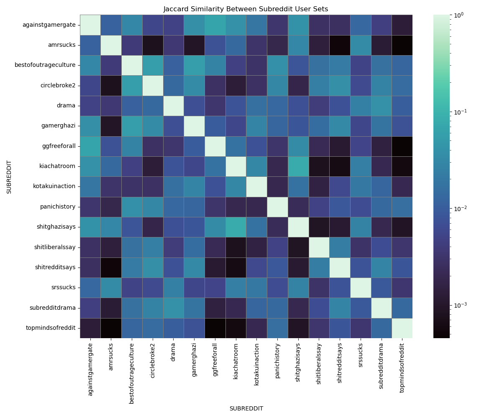

<!--- Script that closes the menu when clicking a nav link-->

# Introduction
## What are we talking about ?
Our datastory is about [Gamergate](https://en.wikipedia.org/wiki/Gamergate), an online harassement campaign against feminism, diversity, and progressivism in video game culture, that was present on multiple online platforms, including reddit. Two subreddits where created in response: r/KotakuInAction, r/GamerGhazi, which exclusively are about this topic. The trigger for this event was a blog post published in August 2014 by Eron Gjoni, the ex-partner of game developer Zoë Quinn, in which he made allegations about their personal relationship.

Although the claims were personal and unverified, they were seized upon by segments of online communities, which quickly shifted the focus toward accusations of “ethics in games journalism.” In practice, however, the movement became dominated by coordinated harassment, particularly targeting women in gaming, including Quinn, Anita Sarkeesian, and Brianna Wu, through doxxing, threats, and sustained online abuse.

>Anyone else having seen the cultural insanity of SJW's spreading far enough that they are considering just giving up on the first world?

Posted on r/KiAChatroom

<iframe src="assets/posts_per_day_gamerghazi.html" class="iframe_standard"></iframe>

<iframe src="assets/posts_per_day_kotakuinaction.html" class="iframe_standard"></iframe>

These two graphs show the number of posts in each of the subreddits created during the Gamer gate, we can see that peak activity was around the end of october. The post volume on r/GamerGhazi stayed elevated until march of 2015, where it declined and stabilized. r/KotakuInAction saw a rapid peak and decline, and subsequent stabilization after the initial burst of posting.

## Why this topic ?
Reddit’s semi-anonymous structure and inconsistent moderation practices have historically made it a fertile environment for the rapid spread of hostility and harassment. In this datastory, we examine the evolution of one such episode, using data to uncover how the event unfolded across the platform and how various communities responded, interacted, and influenced each other during the escalation. 

## The datasets
### Reddit Hyperlink Network
The main dataset (available [here](https://snap.stanford.edu/data/soc-RedditHyperlinks.html)) used for this project was created by a group at Stanford. It is composed of two separate datasets with the same structure, with the only difference being that the first is extracted from post titles and the second one from the post bodies :

| Label | Description |
| ------- | ------- |
| **SOURCE_SUBREDDIT** | The subreddit where the link was posted | 
| **TARGET_SUBREDDIT** | The subreddit that the link links to | 
| **POST_ID** | Unique id of the post |
| **TIMESTAMP** | Time of the post |
| **LINK_SENTIMENT** | 1 for positive or neutral intent, -1 for negative intent |
|**PROPERTIES**| Multiple integer fields grouped in a csv, visit the dataset source for more information|

This data represents a hyperlink network and was extracted from publicly available Reddit data of 2.5 years from Jan 2014 to April 2017.

### Pushshift
The second dataset we used has been generated by pushshift, which uses the Reddit API to extract and save post data to create a snapshot of Reddit accessible to the public (obtained [here](https://academictorrents.com/details/ba051999301b109eab37d16f027b3f49ade2de13)). We selected the same period of time as the first dataset (Jan 2014 to April 2017). It contains a log and metadata of all posts made during the time period, including usernames, titles, post bodies and more!  

## Data processing
We noticed that the reddit hyperlink dataset has some issues :
1. The post id's sometimes have an 's' appended to them, which we had to remove to be able to match the posts with the ones we got from the pushshift dataset. Since all valid id's are of length 6, we could drop the last character in the ones that where longer.
2. The timestamps of the reddit hyperlink are quite innacurate, we could not figure out why this is the case. After manual review, we determined that the timestamps of the pushshift dataset are acccurate and we replaced the timestamps of the hyperlink dataset with these, matching on the post id's.

Additionally, to make it easier to work with the Pushshift dataset, we only kept the following attributes:

| Label | Description |
| ------- | ------- |
| **SUBREDDIT** | The subreddit of the post | 
| **USERNAME** | Username of the post author | 
| **POST_ID** | Unique id of the post |
| **TIMESTAMP** | Time of the post |
| **TITLE** | Text of the post title |
| **BODY_TEXT** | Text of the post body|
| **NUM_COMMENTS** | Number of comments under the post |

We chose to reduce our dataset to the subreddits that interact the most with either r/kotakuinaction (main pro-GamerGate subreddit) or r/gamerghazi (main counterpart of kotakuinaction) between 2014-07-01 and 2016-09-30.

<iframe src="assets/top50_interactions_kotakuinaction.html" class="iframe_standard"></iframe>
<iframe src="assets/top50_interactions_gamerghazi.html" class="iframe_standard"></iframe>

# Research questions

# Look at the players

<iframe src="assets/stacked_bar_transition.html" class="iframe_standard"></iframe>

# How it played out

<iframe class="iframe_75" src="assets/slider_graph_and_bar_chart.html"></iframe>

# Gamer speech pattern / hate speech pattern

<iframe src="assets/pred_accuracy_all.html" class="iframe_standard"></iframe>

<iframe src="assets/pred_accuracy_struct.html" class="iframe_standard"></iframe>

<iframe src="assets/pred_accuracy_liwc.html" class="iframe_standard"></iframe>

# Topics

<iframe src="assets/topics_monthly_kia.html" class="iframe_standard"></iframe>

<iframe src="assets/topics_monthly_gia.html" class="iframe_standard"></iframe>

<iframe src="assets/topics_monthly_mgtow.html" class="iframe_standard"></iframe>

<iframe class="iframe_standard" src="assets/topics_subreddit.html"></iframe>

<iframe class="iframe_standard" src="assets/cluster_accuracy.html"></iframe>

# Conclusion

# References 
- Cover image: [hhttps://spectrum.ieee.org/media-library/different-shades-of-blue-and-yellow-lines-with-bright-spots-of-light-curving-against-a-black-background.jpg?id=52552740&width=3600&height=2400](https://spectrum.ieee.org/media-library/different-shades-of-blue-and-yellow-lines-with-bright-spots-of-light-curving-against-a-black-background.jpg?id=52552740&width=3600&height=2400)